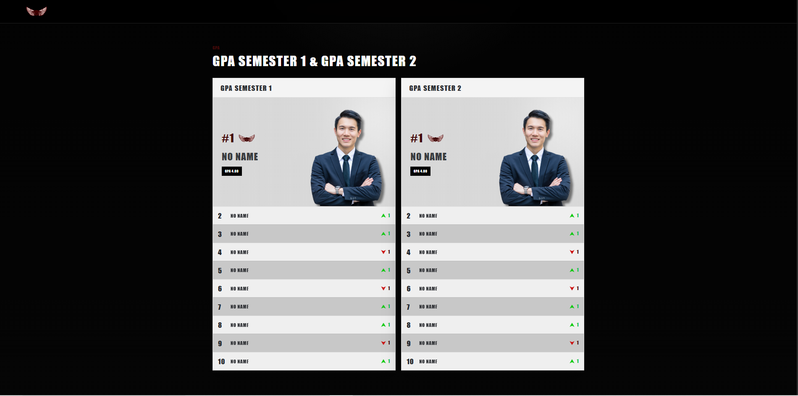

<div align="center">


<br />


<br />


</div>

# Page Leaderboard GPA - Vibe Coding

## English

**Page Leaderboard GPA - Vibe Coding** is a static web leaderboard page designed to display GPA information for Semester 1 and Semester 2 through a clean, bold, responsive, and SEO friendly frontend interface.

This project transforms a leaderboard visual concept into an academic performance dashboard. Instead of displaying athlete rankings, the interface is redesigned to present GPA semester boards, academic score labels, profile image placement, movement indicators, hover interaction, documentation page, and structured metadata for future development.

The project is built using **HTML, CSS, and JavaScript**. It focuses on frontend layout composition, responsive board design, clean typography, image placement, interaction animation, dynamic ranking data, SEO metadata, and portfolio ready documentation.

## Indonesia

**Page Leaderboard GPA - Vibe Coding** adalah halaman web statis berbentuk leaderboard yang dirancang untuk menampilkan informasi GPA Semester 1 dan Semester 2 melalui tampilan frontend yang bersih, tegas, responsif, dan SEO friendly.

Project ini mengubah konsep visual leaderboard menjadi dashboard performa akademik. Alih-alih menampilkan ranking atlet, interface ini didesain ulang untuk menampilkan board semester, label nilai GPA, penempatan foto profil, movement indicator, animasi hover, halaman dokumentasi, serta metadata yang rapi untuk pengembangan lanjutan.

Project ini dibuat menggunakan **HTML, CSS, dan JavaScript**. Fokus pengembangannya meliputi komposisi layout frontend, desain board responsif, tipografi tegas, penempatan gambar, animasi interaksi, data ranking dinamis, metadata SEO, dan dokumentasi project yang siap digunakan sebagai portofolio.

---

## Visual Preview | Pratinjau Visual

<p align="center">
  
</p>

<p align="center">
  <sub><b>EN:</b> Latest GPA leaderboard page preview with responsive semester card board layout.</sub><br>
  <sub><b>ID:</b> Pratinjau terbaru halaman leaderboard GPA dengan layout card board semester responsif.</sub>
</p>

---

## Project Identity

```text
Project Name     : Page Leaderboard GPA - Vibe Coding
Repository Name  : page-leaderboard-gpa-vibe-coding
Version          : 1.0.0
Project Type     : Static Web Page
Development Area : Frontend Web Design
Main Feature     : GPA Semester Leaderboard
Technology       : HTML, CSS, JavaScript
SEO Direction    : Dynamic friendly metadata structure
Mobile Direction : Responsive leaderboard interface
Developer        : GLAND JERMANO BLESSED SIAHAAN
Location         : Medan, Indonesia
GitHub           : GblessSHN-boop
Current Status   : Initial Stable Frontend Prototype
```

---

## Main Concept

Page Leaderboard GPA is designed as a compact academic leaderboard interface. The page presents GPA information in two main semester boards.

```text
GPA SEMESTER 1
GPA SEMESTER 2
```

The layout uses a dark background, high contrast board area, bold typography, profile image composition, movement indicators, and hover interaction to create a strong academic dashboard appearance.

This project is also prepared for future CRUD development. If the ranking names, GPA values, semester labels, profile images, or movement indicators are later generated dynamically from a database, the page structure can still support SEO friendly content through semantic HTML, metadata, dynamic title structure, and clean data rendering.

---

## Main Feature Direction

```text
Two semester leaderboard boards
GPA 4.00 score label
NO NAME placeholder data
Profile image placement
Title badge beside rank number one
Movement indicator for rank movement
Hover reveal animation from name to GPA score
SEO friendly HTML structure
Mobile friendly responsive layout
Documentation page with EN and ID content
Footer copyright and social media icons
Clean repository documentation
```

---

## Core Features

### GPA Semester Leaderboard

The interface displays two academic leaderboard boards for Semester 1 and Semester 2. Each board uses the same structure so the layout stays consistent and easy to edit.

### Dynamic Data Rendering

The ranking data is managed from JavaScript. The name, rank, GPA value, movement direction, movement number, image path, and semester title can be adjusted from the data object.

### Hover GPA Reveal

Rows from rank 2 to rank 10 use a hover interaction. When the cursor is placed over the name area, the `NO NAME` label transitions into `GPA 4.00` using a smooth blur animation.

### Movement Indicator

The leaderboard includes clean movement icons for upward and downward ranking movement. The icons use transparent background assets to keep the layout clean.

### Title Badge

Rank number one includes a small title badge beside the `#1` label. The badge supports hover identity through title or link behavior.

### Responsive Layout

The layout is designed to remain usable across desktop and mobile screens. The board can stack vertically on smaller screens while preserving the visual identity.

### SEO Friendly Structure

The project includes SEO metadata, Open Graph metadata, Twitter card metadata, semantic page titles, description content, and scalable structure for future dynamic CRUD integration.

### Documentation Page

The project includes a separate documentation page with simple, sharp, and square visual direction. The documentation uses English and Indonesian content support.

---

## Visual Identity

```text
Primary Background : #000000
Theme Red          : #430808
Card Background    : #D8D8D8
Light Row          : #EDEDED
Dark Row           : #CFCFCF
Text Dark          : #2B2D31
Text Light         : #FFFFFF
Design Style       : Bold, clean, formal, academic, leaderboard inspired
UI Direction       : Sharp corner, no rounded card, high contrast, compact layout
Typography         : Impact Regular style direction
```

The interface avoids rounded card corners and soft capsule elements. The visual direction is built with sharp rectangular forms, high contrast surfaces, and a strong leaderboard inspired layout.

---

## SEO Direction

This project is prepared with SEO friendly frontend structure.

SEO elements include:

```text
Descriptive page title
Meta description
Meta keywords
Canonical friendly structure
Open Graph title
Open Graph description
Open Graph image
Twitter card metadata
Semantic content hierarchy
Accessible image alt text
Readable anchor labels
Future friendly dynamic content structure
```

Future CRUD direction:

```text
Student name can replace NO NAME
GPA score can replace GPA 4.00
Semester label can be generated dynamically
Profile image can be loaded from database
Movement indicator can be calculated from ranking history
SEO title can be generated from selected semester
SEO description can include updated leaderboard data
```

This makes the interface suitable as a static prototype and also scalable for a future dynamic GPA leaderboard system.

---

## Mobile Friendly Direction

The page is designed to adapt to smaller screens through responsive CSS.

Mobile direction includes:

```text
Stacked leaderboard boards
Flexible board width
Responsive image placement
Readable row spacing
Footer layout adjustment
Documentation page readability
Touch friendly social icons
Reduced horizontal overflow
```

The goal is to keep the leaderboard readable and visually consistent on desktop, tablet, and mobile devices.

---

## Tech Stack

| Area | Technology |
|---|---|
| Structure | HTML |
| Styling | CSS |
| Interaction | JavaScript |
| Asset Type | PNG and SVG |
| SEO | HTML Meta Tags and Semantic Structure |
| Responsiveness | CSS Media Query |
| Version Control | Git and GitHub |
| Editor | Visual Studio Code |
| Terminal | PowerShell |
| Operating System | Microsoft Windows |
| Documentation | Markdown |

---

## Languages, Frameworks, and Tools

### Frontend Development

<p align="left">
  <a href="https://skillicons.dev">
    
  </a>
</p>

### Project Structure and Documentation

<p align="left">
  <a href="https://skillicons.dev">
    
  </a>
</p>

### AI Assisted Development

<p align="left">
  
  
  
</p>

---

## Current Folder Structure

```text
page-leaderboard-gpa-vibe-coding
├── assets
│   ├── icons
│   │   ├── movement
│   │   │   ├── down-clean.png
│   │   │   └── up-clean.png
│   │   ├── social
│   │   │   ├── github.png
│   │   │   ├── instagram.svg
│   │   │   └── linkedin.svg
│   │   └── title
│   │       └── tittle-by-gland.png
│   └── images
│       └── orang.png
├── docs
│   └── readme
│       └── visual-preview-latest.png
├── documentation.html
├── index.html
├── main.js
├── style.css
├── README.md
├── LICENSE
├── VERSION
└── .gitignore
```

---

## Current Version Scope

Version 1.0.0 is the initial stable frontend prototype.

Included in this version:

```text
Static HTML page structure
Custom CSS styling
JavaScript based leaderboard rendering
Two GPA semester boards
Profile image placement
Title badge integration
Clean movement indicator assets
Hover GPA reveal animation
SEO metadata setup
Mobile friendly CSS structure
Documentation page
Footer copyright and social media links
README visual preview
License and version file
GitHub repository setup
```

---

## Page Structure

```text
index.html
Main GPA leaderboard page.

documentation.html
Documentation page containing project explanation, feature summary, usage notes, and EN or ID content direction.

style.css
Main styling file for layout, typography, responsive design, footer, icons, leaderboard board, and documentation page.

main.js
Main JavaScript file for ranking data, board rendering, movement indicator rendering, and hover data behavior.
```

---

## Data Structure Direction

The leaderboard data can be managed in JavaScript.

Example data direction:

```text
Semester board title
Profile image path
Rank number
Student name
GPA score
Movement direction
Movement value
Title badge
```

This structure can later be converted into a CRUD based system using backend and database integration.

---

## Future CRUD Development Direction

This static prototype can be developed into a dynamic GPA leaderboard system.

Possible future CRUD features:

```text
Create student data
Read leaderboard data
Update GPA score
Delete student data
Upload profile image
Manage semester boards
Manage rank movement
Generate SEO title dynamically
Generate SEO description dynamically
Export leaderboard data
Admin dashboard integration
```

Possible future backend stack:

```text
PHP and MySQL
Node.js and Express
Laravel
Firebase
Supabase
REST API
JSON based static data
```

---

## Local Development

Open the project with Visual Studio Code.

```powershell
code .
```

Run the project using Live Server, then open:

```text
index.html
```

Open documentation page:

```text
documentation.html
```

Recommended development workflow:

```powershell
git status
git add .
git commit -m "Update GPA leaderboard page"
git push
```

---

## Git Workflow

Common Git workflow:

```powershell
git status
git add .
git commit -m "Update GPA leaderboard project"
git push
```

Create version tag:

```powershell
git tag -a v1.0.0 -m "Page Leaderboard GPA version 1.0.0"
git push origin v1.0.0
```

---

## Development Roadmap

### Phase 1

Create static frontend structure, prepare GPA leaderboard layout, and push initial repository to GitHub.

### Phase 2

Refine two card board system for GPA Semester 1 and GPA Semester 2.

### Phase 3

Improve profile image crop system, object position, spacing, and visual balance.

### Phase 4

Add title badge, movement indicator, hover GPA reveal, and social footer.

### Phase 5

Add documentation page, SEO metadata, mobile friendly layout, and README preview.

### Phase 6

Prepare optional CRUD system direction for future dynamic leaderboard management.

---

## Vibe Coding Workflow

In this repository, vibe coding refers to an experimental development workflow where the developer combines visual exploration, AI assisted coding, manual revision, frontend styling, Git workflow, and structured documentation.

The purpose is not to randomly generate a page. The purpose is to use AI as a development partner while the developer still controls the design direction, naming system, layout decision, repository workflow, and final implementation.

---

## About the Developer

I am **GLAND JERMANO BLESSED SIAHAAN**, a developer from **Medan, Indonesia**.

Current development focus:

```text
Frontend web development
HTML, CSS, and JavaScript
UI layout exploration
Static website prototyping
Responsive web interface
SEO friendly frontend structure
Portfolio project building
Git and GitHub workflow
Project documentation
AI assisted development
Vibe coding workflow
```

---

## Connect and Contact

```text
Developer : GLAND JERMANO BLESSED SIAHAAN
GitHub    : https://github.com/GblessSHN-boop
LinkedIn  : https://www.linkedin.com/in/glandsiahaan/
Instagram : https://www.instagram.com/glandsiahaan
Location  : Medan, Indonesia
```

---

## Project Notice

Page Leaderboard GPA - Vibe Coding is an experimental static web page prototype.

This project is not an official commercial product unless formally authorized. The page concept, source code, documentation, visual direction, folder structure, and planning materials are used as part of a frontend web design and development experiment.

Page Leaderboard GPA - Vibe Coding adalah prototype halaman web statis yang bersifat eksperimental.

Project ini bukan produk komersial resmi kecuali telah memperoleh otorisasi formal. Konsep halaman, source code, dokumentasi, arah visual, struktur folder, dan materi perencanaan digunakan sebagai bagian dari eksperimen desain dan pengembangan frontend web.

---

## Copyright and Usage Notice

Copyright (c) 2026 GLAND JERMANO BLESSED SIAHAAN. All rights reserved.

This repository, including its source code, design concept, documentation, written content, folder structure, visual direction, project planning, and related materials, is protected by copyright.

No permission is granted to copy, modify, redistribute, sublicense, publish, sell, commercialize, or use this repository for institutional, commercial, or production purposes without prior written permission from the copyright holder.

Viewing, opening, cloning, forking, or accessing this repository does not grant any license, usage right, or permission to use any part of this project.

This repository is provided only for personal learning, frontend web experimentation, portfolio development, and non commercial review.

## Catatan Hak Cipta dan Penggunaan

Hak cipta (c) 2026 GLAND JERMANO BLESSED SIAHAAN. Seluruh hak cipta dilindungi.

Repository ini, termasuk source code, konsep desain, dokumentasi, konten tertulis, struktur folder, arah visual, perencanaan project, dan seluruh materi terkait, dilindungi oleh hak cipta.

Tidak diberikan izin untuk menyalin, memodifikasi, mendistribusikan ulang, memberikan sublisensi, menerbitkan, menjual, mengomersialkan, atau menggunakan repository ini untuk kepentingan institusional, komersial, maupun produksi tanpa izin tertulis dari pemegang hak cipta.

Melihat, membuka, melakukan clone, fork, atau mengakses repository ini tidak berarti memperoleh lisensi, hak penggunaan, atau izin untuk menggunakan bagian apa pun dari project ini.

Repository ini hanya disediakan untuk pembelajaran pribadi, eksperimen frontend web, pengembangan portofolio, dan peninjauan non komersial.

---

## License

Full proprietary license text is available in [LICENSE](./LICENSE).

No open source license is granted for this repository.

All rights are reserved by the owner. This project may not be used, copied, modified, distributed, published, sold, commercialized, or claimed without written permission.

<div align="center">


</div>
